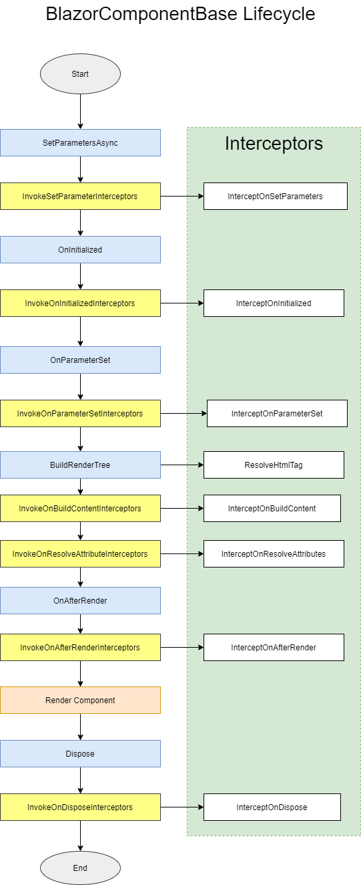

# ComponentBuilder

一个自动化框架，可帮助您更轻松、更快速地构建 Blazor 组件库。

[English](README.md) | [文档](https://github.com/AchievedOwner/ComponentBuilder/wiki) 

 


## :sparkles: 特性

* 组件的自动化参数构建
* 易于定制和个性化组件构建
* 易于构建灵活的动态组件结构
* 易于代码和 javascript 之间的交互
* 组件构建自动化的模块化实现
* RenderTreeBuilder 的强大扩展
* 其他自动化...

## :rainbow: 组件定义

* 在 `Button.razor`
```html
@inherits BlazorComponentBase

<button @attributes="AdditionalAttributes">
    @ChildContent
</button>

@code{
    [CssClass("btn")]
    public Button()
    {
    }

    [Parameter][CssClass("active")]public bool Active { get; set; } 
	
	[Parameter][CssClass("btn-")]public Color? Color { get; set; } 

	[Parameter]public RenderFragment? ChildContent { get; set; } 

	[Parameter][HtmlData("tooltip")]public string? Tooltip { get; set; } 

	[Parameter][HtmlEvent("onclick")]public EventCallback<ClickEventArgs> OnClick { get; set; }

    [Parameter][HtmlAttribute]public string? Title { get; set; }
    
    public enum Color
    {
	    Primary,
	    Secondary,
	    [CssClass("info")]Information,
    }
}
```

* 在 `Button.cs` 类
```csharp
[HtmlTag("button")]
[CssClass("btn")]
public class Button : BlazorComponentBase, IHasChildContent, IHasOnClick
{
	[Parameter][CssClass("active")]public bool Active { get; set; } 
	
	[Parameter][CssClass("btn-")]public Color? Color { get; set; } 

	[Parameter]public RenderFragment? ChildContent { get; set; }

	[Parameter][HtmlData("tooltip")]public string? Tooltip { get; set; }

	[Parameter][HtmlEvent("onclick")]public EventCallback<ClickEventArgs> OnClick { get; set; 

    [Parameter][HtmlAttribute]public string? Title { get; set; }
}

public enum Color
{
	Primary,
	Secondary,
	[CssClass("info")]Information,
}
```
* 使用和对比
```html
<!--razor-->
<Button Color="Color.Primary">Submit</Button>
<!--html-->
<button class="btn btn-primary">Submit</button>

<!--razor-->
<Button Active Tooltip="active button" Color="Color.Information" Title="click me">Active Button</Button>
<!--html-->
<button class="btn btn-info active" data-tooltip="active button" title="click me">Active Button</button>
```


## :key: C# 和 Javascript 交互

* 导入模块
```js
//in app.js
export function display(){
 // ...your code
}
```

```csharp
[Inject]IJSRuntime JS { get; set; }

var js = await JS.Value.ImportAsync("./app.js");
js.display(); // same as function name
```

* 执行 js 字符串
```csharp
JS.Value.EvaluateAsync(window => {
    window.console.log("log")
});

JS.Value.EvaludateAsync(@"
    console.log(\"log\");
")
```

## :information_source: 个性化 CSS/Style/Attributes
* Logical CSS
```csharp
protected override void BuildCssClass(ICssClassBuilder builder)
{
    if(builder.Contains("annotation-enter"))
    {
        builder.Remove("annotation-exist");
    }
    else
    {
        builder.Append("annotation-enter").Append("annotation-exist");
    }
}
```
* Logical Attributes
```csharp
protected override void BuildAttributes(IDictionary<string, object> attributes)
{
    attributes["onclick"] = HtmlHelper.Event.Create(this, ()=>{ ... });
    
    if(attrbutes.ContainKey("data-toggle"))
    {
        attributes["data-toggle"] = "collapse";
    }
}
```
## :palm_tree: RenderTreeBuilder 的扩展
* 创建元素
```csharp
protected override void BuildRenderTree(RenderTreeBuilder builder)
{
    builder.Open("div")
            .Class("my-class", (IsActive, "active"), (!string.IsNullOrEmpty(Name), "text-block"))
            .Style((Size.HasValue, $"font-size:{Size}px"))
            .Content("hello world")
           .Close();

    builder.CreateElement(10, "span", "hello", attributes: new { @class = "title-span"});

}
```

* 创建组件

```csharp
protected override void BuildRenderTree(RenderTreeBuilder builder)
{
    builder.Open<Button>()
            .Class("my-class", (IsActive, "active"), (!string.IsNullOrEmpty(Name), "text-block"))
            .Style((Size.HasValue, $"font-size:{Size}px"))
            .Content(ChildContent)
           .Close();

    builder.CreateComponent<NavLink>(0, "Home", new { NavLinkMatch = NavLinkMatch.All, ActiveCssClass = "nav-active" })
}
```

## :children_crossing: 关联组件
### 在 .razor 文件
* `List.razor` 作为父组件
```html
<ul @attributes="AdditionalAttributes">
    <CascadingValue Value="this">
        @ChildContent
    </CascadingValue>
</ul>
```

* `ListItem.razor` 作为子组件
```html
<li @attributes="AdditionalAttributes">@ChildContent</li>

@code{
    [ChildComponent(typeof(List))]
    public ListItem()
    {
    }

    [CascadingParameter] public List CascadedList { get; set; }

    [Parameter] public RenderFragment? ChildContent { get; set; }
}
```

### 在 RenderTreeBuilder 中
* `List` 组件类
```csharp
[ParentComponent] //be cascading parameter for this component
[HtmlTag("ul")]
public class List : BlazorComponentBase, IHasChildContent
{

}
```
* `ListItem` 组件类
```cs
[ChildComponent(typeof(List))] //Strong association with List
[HtmlTag("li")]
public class ListItem : BlazorComponentBase, IHasChildContent
{
    [CascadingParameter]public List CascadedList { get; set; }

    [Parameter] public RenderFragment? ChildContent { get; set; }
}
```

### 组件的使用

```html
<List>
    <ListItem>...</ListItem>
</List>

<ListItem /> <!--ListItem 组件不在 List 组件中将抛出异常-->

```

## :six_pointed_star: HtmlHelper

* 在 `.razor` 中

```html
<div class="@GetCssClass">
...
</div>
```

```csharp
@code{
string GetCssClass => HtmlHelper.Class.Append("btn-primary").Append("active", Actived).ToString();
    
[Parameter] public bool Actived { get; set; }
}
```

* 应用于 RenderTreeBuilder 时

```cs
builder.CreateElement(0, "span", attributes: 
    new { 
            @class = HtmlHelper.Class
                                .Append("btn-primary")
                                .Append("active", Actived),
            style = HtmlHelper.Style.Append($"width:{Width}px"),
            onclick = HtmlHelper.Event.Create<MouseEventArgs>(this, e=>{ //...click... });
        });
```

## :crossed_swords: 拦截器
您可以拦截组件的生命周期

* 定义拦截器
```csharp
public class LogInterceptor : ComponentInterceptorBase
{
    private readonly ILogger<LogInterceptor> _logger;
    public LogInterceptor(ILogger<LogInterceptor> logger)
    {
        _logger = logger;
    }

    //在 SetParameterAsync 方法中执行
    public override void InterceptSetParameters(IBlazorComponent component, ParameterView parameters)
    {
        foreach(var item in parameters)
        {
            _logger.LogDebug($"Key:{item.Name}, Value:{item.Value}");
        }
    }
}
```
* 注册拦截器
```csharp
builder.Services.AddComponentBuilder(configure => {
    configure.Interceptors.Add(new LogInterceptor());
})
```


## :desktop_computer: 环境支持


## :blue_book: 安装指南

* 从 `Nuget.org` 安装

```bash
Install-Package ComponentBuilder
```

* 注册服务

```csharp
builder.Services.AddComponentBuilder();
```


## :pencil: 组件库解决方案模板
使用 `ComponentBuilder.Templates` 生成组件库解决方案和在线演示站点
```bash
dotnet new install ComponentBuilder.Templates
dotnet new blazor-sln -n {YourRazorLibraryName}
```
更多信息见 [templates](./templates/readme.md)