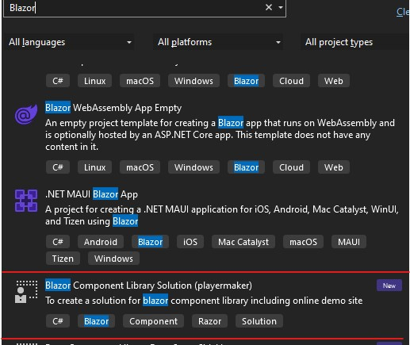

## ComponentBuilder.Templates
A blazor component solution template to help you create a razor library and online demo site

### Quick start

* Install Template
```bash
dotnet new install ComponentBuilder.Templates
```
You can create by `dotnet cli` or `Visual Studio`

* Create Template 
via by `dotnet cli`
```bash
dotnet new blazor-sln -n {Your Component Library Name}
```
via by `Visual Studio`


### Solution Structures
```js
- {YourRazorLibrary}
    |- doc
        |- {YourRazorLibrary}.Docs.ServerSideHost //host by Blazor-Server
            |- Pages
                |- _Host.cshtml
                |- _Layout.cshtml
            |- _Imports.razor
            |- appsettings.json
            |- Program.cs
        |- {YourRazorLibrary}.Docs.Shared
            |- wwwroot
                |- docs.css     //document css
                |- favicon.ico
            |- Components   //Component for your document
            |- Layouts
                |- MainLayout.razor //An empty layout
            |- Pages    //Put your page here
                |- IndexPage.razor  //Name your demo page with `Page` suffix
            |- _Imports.razor
            |- App.razor
        |- {YourRazorLibrary}.Docs.WebAssemblyHost
            |- wwwroot
                |- index.html
            |- _Imports.razor
            |- Program.cs
    |- src
        |- {YourRazorLibrary}   //This is your component library
            |- wwwroot
                |- {YourRazorLibrary}.css   //Component css if need
                |- {YourRazorLibrary}.js    //Component javascript if need
            |- Components   //Put your razor component here
                |- Div.cs   // A sample component
            |- _Imports.razor
            |- DependencyInjectionExtensions.cs
            |- Using.cs //global using
        |- {YourRazorLibrary}.Test  //Unit Test for your component library
            |- DivTest.cs   //A sample unit test for Div component
            |- TestBase.cs  //A test base for UT
            |- Using.cs

```

## TargetFramework Support


